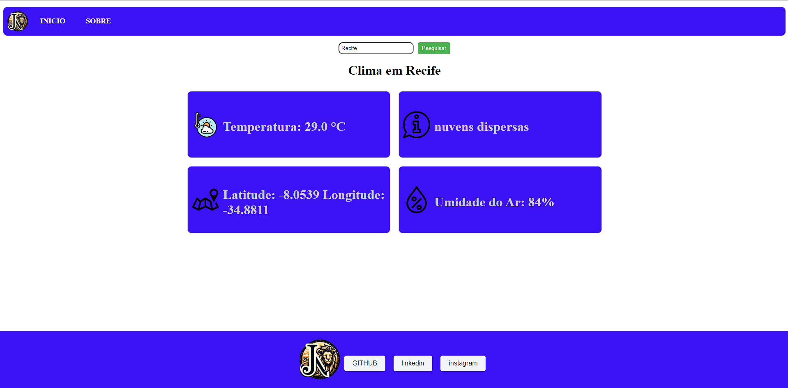

# ClimApp
# Aplicação Angular de Previsão do Tempo

Este projeto é uma aplicação web desenvolvida em Angular que permite aos usuários obterem informações meteorológicas em tempo real. A aplicação consome dados da API OpenWeatherMap para fornecer previsões meteorológicas precisas e atualizadas para diversas cidades ao redor do mundo.

## Recursos Principais

- **Previsão do Tempo**: Os usuários podem pesquisar por qualquer cidade e visualizar informações detalhadas sobre a previsão do tempo, incluindo temperatura, descrição do clima, umidade do ar e coordenadas geográficas.

- **Interface Amigável**: A aplicação possui uma interface de usuário intuitiva e responsiva, garantindo uma experiência de uso agradável em qualquer dispositivo.

- **Integração com API Externa**: A integração com a API OpenWeatherMap permite que a aplicação exiba dados meteorológicos em tempo real, mantendo as informações sempre atualizadas.

## Tecnologias Utilizadas

- Angular: Framework JavaScript de código aberto para construção de aplicativos web.
- TypeScript: Superset do JavaScript que adiciona tipagem estática opcional ao código.
- HTML e CSS: Linguagens de marcação e estilo para o desenvolvimento da interface de usuário.

## Como Executar o Projeto

1. Acesse o Seguinte Link: [ClinApp](https://climapp-three-rho.vercel.app/)

    OU

1. Clone este repositório em sua máquina local.
2. Instale as dependências usando o comando `npm install`.
3. Inicie o servidor de desenvolvimento com o comando `ng serve`.
4. Abra seu navegador e acesse `http://localhost:4200` para visualizar a aplicação.

## Contribuição

Contribuições são bem-vindas! Sinta-se à vontade para abrir uma issue para relatar bugs, sugestões de novos recursos ou propor melhorias no código.

# Preview

This project was generated with [Angular CLI](https://github.com/angular/angular-cli) version 17.2.1.

## Development server

Run `ng serve` for a dev server. Navigate to `http://localhost:4200/`. The application will automatically reload if you change any of the source files.

## Code scaffolding

Run `ng generate component component-name` to generate a new component. You can also use `ng generate directive|pipe|service|class|guard|interface|enum|module`.

## Build

Run `ng build` to build the project. The build artifacts will be stored in the `dist/` directory.

## Running unit tests

Run `ng test` to execute the unit tests via [Karma](https://karma-runner.github.io).

## Running end-to-end tests

Run `ng e2e` to execute the end-to-end tests via a platform of your choice. To use this command, you need to first add a package that implements end-to-end testing capabilities.

## Further help

To get more help on the Angular CLI use `ng help` or go check out the [Angular CLI Overview and Command Reference](https://angular.io/cli) page.
